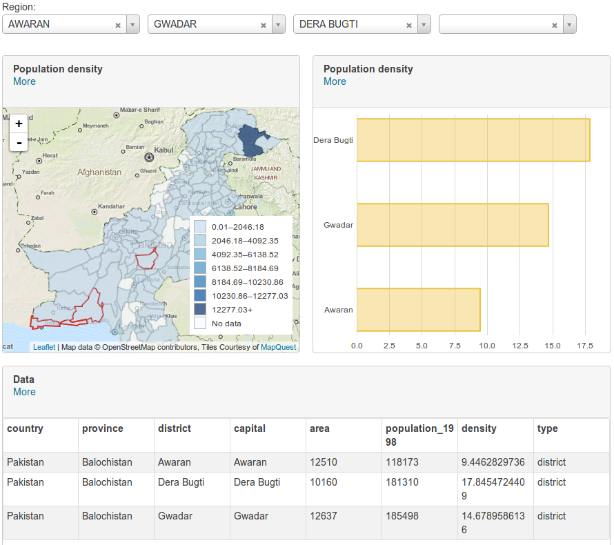
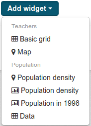

ckanext-dashboard
=================



This extension adds a dashboard to CKAN, which provides way to organize many of
the new Resource View being developed in
https://github.com/ckan/ckan/tree/1251-resource-view in a single page.

Installation
------------

This extension depends on the latest unreleased CKAN version being worked on
the master branch and
[ckanext-viewhelpers](//github.com/ckan/ckanext-viewhelpers). You have to
install that first.

After that, simply clone this repository and run ```python setup.py install```.
Then add ```dashboard_preview``` to the list in ```ckan.plugins``` in your CKAN
config file. Make sure to put it after ```viewhelpers```.

Restart your webserver. You should see the new "Dashboard" chart type as an
option in the view type's list on any resource.

Usage
-----

First of all, you need to have created the charts that will form the dashboard.
Using the sample dashboard above as an example, you'd need a choropleth map
(from [ckanext-mapviews](https://github.com/ckan/ckanext-mapviews)), a bar
chart and a basic grid (both from
[ckanext-basiccharts](https://github.com/ckan/ckanext-basiccharts)) before
starting the dashboard.

After you do that, go to the ```Manage resource``` page of the resource you
want to create the dashboard for, and create a new ```Dashboard``` view.

When you start creating a dashboard, before you're able to preview it and add
any widgets, you need to decide it's title (you can change it later). Go ahead
and write ```My Dashboard``` in the title input and click on ```Preview```.

You should see a boring, empty dashboard at the bottom of the page. If you're
paying attention, you'd notice that the ```Add widget``` and ```Add widget from
URL``` buttons are now activated. Let's go ahead and start our first widget.

Click on the ```Add widget``` button. You should see something similar to:



There you'd see a list of every resource views' that belong to any resource in
the current dataset, grouped by resource. Select a few of them.

They'll be added to the dashboard preview in the bottom of the page. There you
can resize them simply by dragging their borders, and also reorganize them on
the dashboard by dragging and dropping.

If you'd like to allow the user to filter the data, click on `Add filter` on
the `Allowed filters` field. You can select which columns are filterable
(it's only possible to add textual or date columns currently), and change their
labels. To understand how the filters work, check
[ckanext-viewhelpers](//github.com/ckan/ckanext-viewhelpers/#filters).

When you're happy with your dashboard, click on ```Add``` to save it. You're
done! If you go to the resource's page, you should see it.

License
-------

Copyright (C) 2014 Open Knowledge Foundation

This program is free software: you can redistribute it and/or modify
it under the terms of the GNU Affero General Public License as published
by the Free Software Foundation, either version 3 of the License, or
(at your option) any later version.

This program is distributed in the hope that it will be useful,
but WITHOUT ANY WARRANTY; without even the implied warranty of
MERCHANTABILITY or FITNESS FOR A PARTICULAR PURPOSE.  See the
GNU Affero General Public License for more details.

You should have received a copy of the GNU Affero General Public License
along with this program.  If not, see <http://www.gnu.org/licenses/>.
